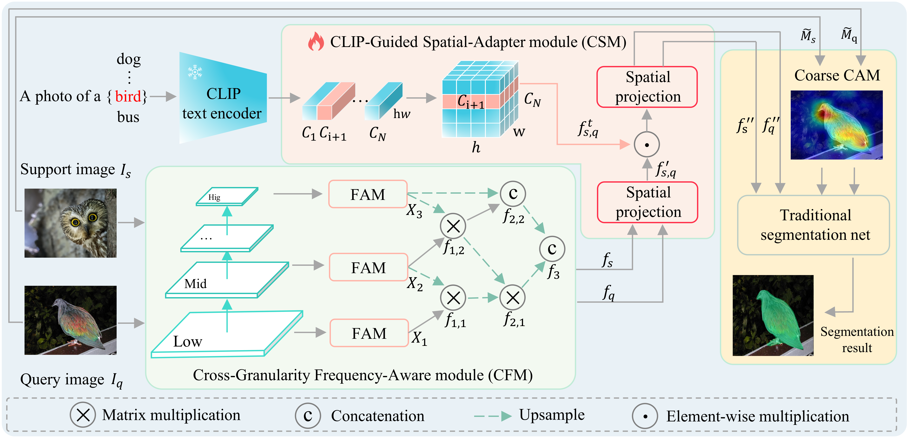

# AFANet: Adaptive Frequency-Aware Network for Weakly-Supervised Few-Shot Semantic Segmentation

The completed code will be released when the paper is accepted.

## Abstract
<div align=center></div> 

Few-shot learning aims to recognize novel concepts by leveraging prior knowledge learned from a few samples. However, for visually intensive tasks such as few-shot semantic segmentation, pixel-level annotations are time-consuming and costly. Therefore, in this work, we utilize the more challenging image-level annotations and propose an adaptive frequency-aware network (AFANet) for weakly-supervised few-shot semantic segmentation (WFSS). Specifically, we first propose a cross-granularity frequency-aware module (CFM) that decouples RGB images into high-frequency and low-frequency distributions and further optimizes semantic structural information by realigning them. Unlike most existing WFSS methods using the textual information from the language-vision model CLIP in an offline learning manner, we further propose a CLIP-guided spatial-adapter module (CSM), which performs spatial domain adaptive transformation on textual information through online learning, thus providing cross-modal semantic information for CFM. Extensive experiments on the Pascal-5\textsuperscript{i} and COCO-20\textsuperscript{i} datasets demonstrate that AFANet has achieved state-of-the-art performance.
<!-- 
## :fire: News
- AFANet is accepted by xxx.
-->
<!-- 
For further details and visualization results, please check out our [paper](XXXXXX).
-->
## Installation (Recommend)
1. Download the environment we have packaged: [Google drive](https://drive.google.com/file/d/1z1bjhJON1z2-T8bjL8wiwXloY3NOaGbZ/view?usp=drive_link) or [Baidu drive](https://pan.baidu.com/s/1E4f4Xl8epAguo0hxGijF_w?pwd=n4nm). Baidu extraction code: n4nm
2. Create the folder afanet in the conda envs directory
```bash
mkdir afanet
```
3. Put afanet_envs.tar.gz into afanet folder and type:
```bash
tar -zxvf afanet_envs.tar.gz
```
## Installation (Regular)

Conda environment settings:
## AFANet: Adaptive Frequency-Aware Network for Weakly-Supervised Few-Shot Semantic Segmentation
This is the implementation of the paper "AFANet: Adaptive Frequency-Aware Network for Weakly-Supervised Few-Shot Semantic Segmentation".  

The codes are implemented based on IMR-HSNet(https://github.com/juhongm999/hsnet), CLIP(https://github.com/openai/CLIP), and https://github.com/jacobgil/pytorch-grad-cam. Thanks for their great work!  

## Requirements (For Chinese, please refer to alternative installation methods below.)

## Environment settings:
```bash
conda create -n afanet python=3.9
conda activate afanet
pip3 install torch torchvision torchaudio
conda install -c conda-forge tensorflow
pip install tensorboardX
```

## Data Preparation
#### PASCAL-5<sup>i</sup>
1. Download PASCAL VOC2012 devkit (train/val data):
```bash
wget http://host.robots.ox.ac.uk/pascal/VOC/voc2012/VOCtrainval_11-May-2012.tar
```
2. Download PASCAL VOC2012 SDS extended mask annotations from HSNet [[Google Drive](https://drive.google.com/file/d/10zxG2VExoEZUeyQl_uXga2OWHjGeZaf2/view?usp=sharing)].
## Preparing Few-Shot Segmentation Datasets
Download following datasets:

> #### 1. PASCAL-5<sup>i</sup>
> Download PASCAL VOC2012 devkit (train/val data):
> ```bash
> wget http://host.robots.ox.ac.uk/pascal/VOC/voc2012/VOCtrainval_11-May-2012.tar
> ```
> Download PASCAL VOC2012 SDS extended mask annotations from HSNet [[Google Drive](https://drive.google.com/file/d/10zxG2VExoEZUeyQl_uXga2OWHjGeZaf2/view?usp=sharing)].
> #### 2. COCO-20<sup>i</sup>
> Download COCO2014 train/val images and annotations: 
> ```bash
> wget http://images.cocodataset.org/zips/train2014.zip
> wget http://images.cocodataset.org/zips/val2014.zip
> wget http://images.cocodataset.org/annotations/annotations_trainval2014.zip
> ```
> Download COCO2014 train/val annotations from HSNet Google Drive: [[train2014.zip](https://drive.google.com/file/d/1cwup51kcr4m7v9jO14ArpxKMA4O3-Uge/view?usp=sharing)], [[val2014.zip](https://drive.google.com/file/d/1PNw4U3T2MhzAEBWGGgceXvYU3cZ7mJL1/view?usp=sharing)].
> (and locate both train2014/ and val2014/ under annotations/ directory).
## Preparing Pre-trained models：
https://drive.google.com/file/d/1HKOGnvijW_KGTja_AdyHisRMXztoT10J/view?usp=sharing
Create a directory 'Dataset' for the above three few-shot segmentation datasets and appropriately place each dataset to have following directory structure:
    Dataset/                       
    └── Datasets_AFANet/
        ├── VOC2012/            # PASCAL VOC2012 devkit
        │   ├── Annotations/
        │   ├── ImageSets/
        │   ├── ...
        │   └── SegmentationClassAug/
        ├── COCO2014/           
        │   ├── annotations/
        │   │   ├── train2014/  # (dir.) training masks (from Google Drive) 
        │   │   ├── val2014/    # (dir.) validation masks (from Google Drive)
        │   │   └── ..some json files..
        │   ├── train2014/
        │   └── val2014/
        ├── CAM_VOC_Train/ 
        ├── CAM_VOC_Val/ 
        └── CAM_COCO/
            
## Preparing CAM for Few-Shot Segmentation Datasets
> ### 1. PASCAL-5<sup>i</sup>
> * Generate Grad CAM for images
> ```bash
> python generate_cam_voc.py --traincampath ../afanet_data/CAM_VOC_Train/
>                            --valcampath ../afanet_data/CAM_VOC_Val/
> ```
> # python generate_cam_voc.py --traincampath ../afanet_data/CAM_VOC_Train --valcampath ../afanet_data/CAM_VOC_Val
### 2. COCO-20<sup>i</sup>
> ```bash
> python generate_cam_coco.py --campath ../afanet_data/CAM_COCO/


## Training
> ### 1. PASCAL-5<sup>i</sup>
> ```bash
> python train.py --backbone {vgg16, resnet50} 
>                 --fold {0, 1, 2, 3} 
>                 --benchmark pascal
>                 --lr 4e-4
>                 --bsz 16
>                 --stage 2
>                 --logpath "your_experiment_name"
>                 --traincampath ../afanet_data/CAM_VOC_Train/
>                 --valcampath ../afanet_data/CAM_VOC_Val/
> ```
